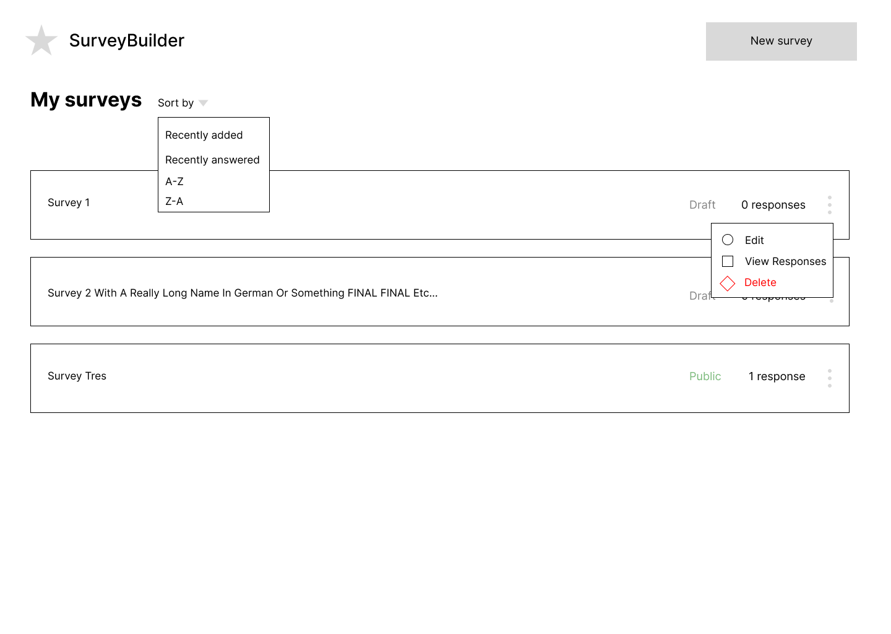

# Survey Builder and Viewer Task (Writeup)

## Design & Ideation

Before beginning to code on this task, I familiarized myself with survey builders.

By quickly going through the Airtable, Typeform, and Google Forms flows, I created a design file with wireframes for myself to visualize the full scope of the application based on seven key UI areas:
  - landing page
  - dashboard
  - creating a new survey
  - survey editing
  - survey sharing
  - taking the survey
  - response viewing

Landing page

Dashboard

Dashboard (empty)

Survey initialization

Survey initialization (with open preview panel)

Editing

Editing (with open preview panel)

Sharing

Taking the survey

Viewing responses (individual)

Viewing responses (individual with full response)

Viewing responses (aggregated)

## Code

I envisioned the project as having three phases: data management, shared UI, and specific UI components.

For the data management phase (commit 1), I decided to implement the part of the description of the task to add loading and error states and add some utilities for managing how data was loaded into the first view (Dashboard).

For the phase of shared components (commit 2), I added the navigation shared by all pages and the preview pane shared by the create and editing views.

For the specific components phase (commit 3), I narrowed my focus to the UI for adding questions in the edit view.

Also before beginning the project, I quickly scanned the documentation for [Tailwind](https://tailwindcss.com/), [Radix](https://www.radix-ui.com/), [Lucide](https://lucide.dev/), and [Sonner](https://sonner.emilkowal.ski/) which were included in the project dependencies.

**[d3a8140](https://github.com/archetype-labs/fe-code-test/commit/d3a81403d2b276381911033938a5f81adc3299f8)**

In the first commit, I focused on creating loading and error states for the dashboard (without changing much else about the UI).

I added a `delay` helper function for delaying the response and returning the surveys from local storage asynchronously, so that the loading state can be seen.
I added `error1in5` to create an error in 1 out of 5 of the responses, so that error states can be seen.
I also added a `retry` function.

I ran into a problem with the NextJS setup while fetching the data for the dashboard, because the layout.tsx file was rendering twice on first load. Due to the randomness I had introduced in the response, fetching twice was not working nicely (sometimes failing both times, sometimes succeeding both times, sometimes a mix) in useEffect. I solved this by creating a `useMount` hook that only fires once. This kind of "use-effect-once" hook is a pattern I've seen in my work at previous software companies, but I don't particularly like it. If I had more time, I would have investigated the layout rerendering more. I suspected it had something to do with the version of NextJS 13.

The loading and error states could also be visually punched up, I left them as plain text and moved on from the `Dashboard` view to work on some shared view components.

**[4bd6628](https://github.com/archetype-labs/fe-code-test/commit/4bd6628b0879cfc7780e6ef9c53d2a055b80ca2b)**

In the next commit, I started tackling the UI for creating and updating surveys, and created some components used in several different views.

One of the reused components created in this commit is the `NavBar`. I knew which buttons I wanted to be present on all of the views, so instead of using the MenuBar of NavigationMenu components included I just created a flex container with the logo/home button on the left and the rest of the buttons conditionally rendered on the right. I added some placeholder logic for these buttons.

Another new component in this commit is the `WithPreview` component, which allows the Create and Edit pages to show a form for adding/updating surveys on the left and a toggleable preview view on the right.
I was quite convinced from my research into survey builders and the wireframing exercise that I wanted the preview to be available while editing at all times. Ideally this would be a nicer-looking sheet that slides out from the right side of the page. Both the existing Drawer and Sheet components were not exactly what I wanted, since they both used portals that I couldn't easily position in the page side-by-side with the editing form. After trying both of these, I settled on using the Resizable component, which doesn't have a nice animation but did have an easy API for collapsing and expanding and didn't require much fiddling with CSS to position inside of the page.

In order to show the survey in the preview pane, I took the contents of the Survey page and extracted them to my `SurveyPage` component. This is also used for the view when taking the survey. There is some extra logic here for when SurveyPage is in preview mode, to show things like placeholder text for un-filled-out fields. At this point it was only the title (previewed in the Create page).

I extracted the logic of the create page to my `CreateForm` component and nested it in WithPreview on the create page, to show the title and description.
I set a limitation on the create page so that you can only initialize and start editing a survey if it at least has a title, because I had found when playing with the prototype that it was too easy to end up with a bunch of undifferentiated, untitled surveys on my Dashboard. At this point I fiddled a little bit with the CSS styles for the Create page inputs, but was happy with its new constraints and preview of the survey, and wanted to jump into survey editing. I added logic when saving the newly created survey to navigate to the Edit page.

**[3f505a](https://github.com/archetype-labs/fe-code-test/commit/3f505a5c1a697a95f200e5850e3b6ea3736e7491)**

In this commit I wanted to refine the survey editing UI with the preview as much as I could in the remaining time. After working in this repo for a few hours I felt I was really getting the hang of Tailwind (not experienced with it, I prefer CSS-in-JS) and started sprinkling in things like icons from the Lucide library as well.

I followed the same pattern established for CreateForm and extracted the logic from the edit page to `EditForm` and wrapped it WithPreview.
I created the `AddQuestionMenu`, which is a DropdownMenu with all of the question types attached to the "Add question" button, and hooked up the existing QuestionBuilder to add blocks of each type on select (instead of a single block whose type can change).

I updated the card UI for each question to show the question type, required toggle, and menu of secondary actions, and started working on the UI for editing questions. I really wanted to add a drag handle to make the questions re-orderable, so I added indexes to the questions as well. Rather than having all of the questions editable at once, I also decided to add state for which question was being actively edited at a time, to outline the question currently being edited, hide the text input for non-active questions, and moved the Edit and Delete buttons to a secondary menu in the question card.

With making saving progress easy and intuitive in mind, I also added a Save Question button at the bottom of each card. It was at this point I noticed that there was no `Toaster` rendered in the tree to show any of the toast messages that were already included in the project. I added a Toaster to the layout component, and added feedback when the question is saved in the form of a "Saved!" toast, moving the question to the non-editing state on save. I would have loved to add auto-saving whenever a survey was updated so that this button wouldn't be necessary. But people do like to click buttons and be told their progress is saved.

I further tweaked the QuestionBuilder and the QuestionDisplay to show placeholder text in the survey for un-filled-out fields, similarly to the create preview.

In the last minutes I had to work on this, I cleaned up a few things:
- fixing the navigation buttons to actually use survey ids to route to the correct pages for edit, view responses, and sharing, so my NavBar on all pages should work as expected
- making sure Delete actions were using text-destructive so they would be red
- adding the eye open and closed icon for my preview toggle
- adding icons for Edit and Delete actions in the question card menu
- changing the Save Survey button at the bottom of the edit form to Save and View Survey, which saves and redirects you to the Survey page

## What Next

If I had more time, this is what I would have prioritized next to fulfill the acceptance criteria of finishing the survey builder and viewer:

1. Adding drag handlers to re-order questions in the editing view - I think this would be really nice to have and quick to do next
2. Work on UI for customizing each question type in the editing view (adding multi-select options, checkboxes, etc.) - I removed part of this while creating the question cards, and was planning to re-add it in a more compact UI
3. Adding the share menu with a toggle to set the survey to draft or public - This seems important not only for the Dashboard view but for survey sharing. This would mean also creating a nice error for the Survey page when the survey is not set to public

If I had even more time, I would then work on:

1. Creating nicer cards for the dashboard with private/public status, number of responses, and secondary menu - I should have done this in the first commit when I was working on the Dashboard but jumped to the editor because I had a clearer vision there to get more specific with the UI
2. Viewing responses as individual and aggregate views - Tables and charts would be fun, I was inspired by the AI Summary idea for showing freeform feedback in aggregate (see wireframe for View Responses (Aggregate))
3. Visual identity - This app is still black and white! And a tiny bit red. It needs a logo, typography, and a few new theme colors.
